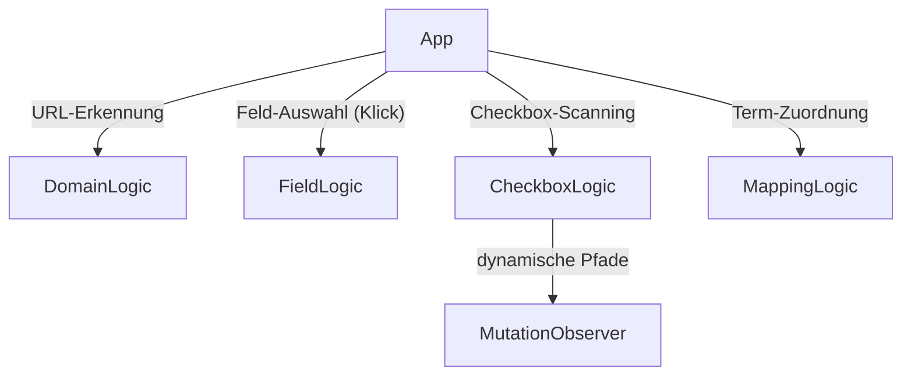
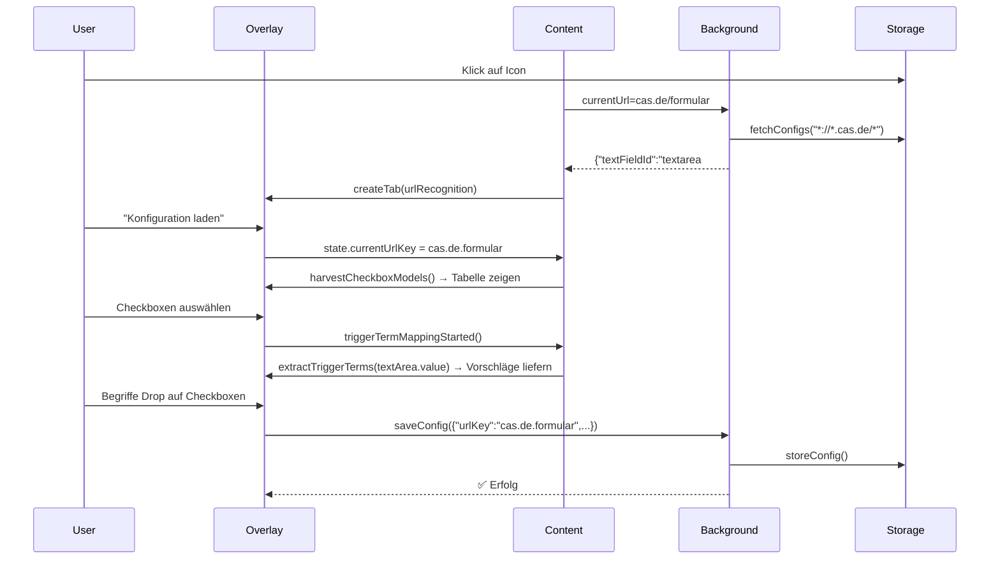

# FormTexter - Architektur & Design Patterns **NEU (05.06.2026)**
**KONZEPT FÜR URL-BASIERTEN WORKFLOW**

## 1. Projektstruktur (aktualisiert)


| Datei                     | Verantwortung                     | URL-fokussierte Änderungen |
|---------------------------|-----------------------------------|----------------------------|
| `background.js`           | Global State + **URL-Matching**  | `getConfigForURL()`, `resolveDomainWildcards()` |
| `content_script.js`       | DOM + **URL-Kontext**            | `currentUrlConfigs`, `setupMutationObserver()` |
| `overlay/overlay.js`      | UI für **URL-basierten Workflow** | Tabs: **URL-Erkennung**, Checkboxen, Zuordnungen |
| `overlay/overlay.css`     | Layout für neue Tabs             | Mobile-responsive URL+Checkbox Integration |

---

## 2. URL-basierte Architektur

### 2.1 **URL ↔ SiteKey-Resolver**
```javascript
// Hintergrundskript - Idee
const RESERVED_DOMAINS = {
  "*://*.autohersteller.de/*":   "autohersteller.konfiguration",
  "*://*.cas.de/antrag/*":       "cas.de.formular",
  "https://outlook.live.com/*":  "outlook.formular"
};

function getSiteKey(url) {
  // Regelbasiert + Wildcards
  const ruleMatch = Object.entries(RESERVED_DOMAINS)
    .find(([regexPattern]) => new RegExp(regexPattern).test(url));
  if (ruleMatch) return ruleMatch[1];

  // Default: Host + Path (stripped)
  return new URL(url).host + new URL(url).pathname.split('/')[1];
}
```

### 2.2 **Storage Schema für URL**
```javascript
// background.js - Struktur
{
  "urlConfigs": {
    "autohersteller.konfiguration": {
      // Feldkontext ↑        | Eindeutige Checkbox-IDs ↓
      "textFieldId": "textarea#interests",
      "checkboxModels": [
        {
          "id": "winterpaket-chk",
          "triggerTerms": ["Sitzheizung", "Scheibenheizung"],
          "state": "active",
          "positionHint": {"x": 240, "y": 450} // Optional: Klick-Koordinaten merken
        }
      ]
    }
  }
}

// Verknüpfung: textFieldId ↔ checkboxModels via UI-Scanning
```

---

## 3. URL-Tab als zentrales Navigationselement

### 3.1 **UI-Zustandsautomat**
```mermaid
stateDiagram-v2
    URL-Erkennung --> Feld-Auswahl : Neue URL
    Feld-Auswahl --> URL-Erkennung : Zurück
    Feld-Auswahl --> Checkbox-Liste : Weiter
    Checkbox-Liste --> Zuordnungen : Checkboxen ausgewählt
    Zuordnungen --> Checkbox-Liste : Zurück
```

| Tab            | UI-Komponente                          | Technische Schlüssel-Methoden |
|----------------|----------------------------------------|--------------------------------|
| URL-Erkennung  | **Domain-Vorschau** + Konfig-Buttons   | `resolveCurrentURL()`, `fetchSimilarConfigs()` |
| Feld-Auswahl   | Feld-ID-Feld + **URL-Speicher-Schalter** | `scanFieldAndPairWithURL()`, `toggleFieldPersistence()` |
| Checkbox-Liste | **Dynamische Tabelle** (ID + Selektor)  | `MutationObserver.observe()`, `checkboxSelected(devId)` |
| Zuordnungen    | Begriffs-Auswahl + Checkbox-ID       | `extractPossibleTerms(text)`, `assignTermToCheckbox()` |

### 3.2 Mockup: URL-Erkennung Tab
```html
<!-- NUR Skizze -->
<tab id="url-recognition-tab">
  <p>URL: <code>https://cas.de/formular</code></p>
  <p>Gespeicherte Konfig: ✅ <strong>FORMULAR_WINTERPAKET</strong></p>

  <div class="ui-buttons">
    <button id="load-config-btn">Konfiguration laden</button>
    <button id="new-config-btn">NEUE Konfiguration erstellen</button>
    <button id="delete-config-btn">🗑 Konfiguration löschen</button>
  </div>

  <details id="url-hints">
    <summary>Ähnliche Konfigurationen (unser Smart Defaults)</summary>
    <ul>
      <li>
        <a href="#" data-url-key="cas.de.payment">cas.de PAYMENT</a>
        <span class="hint">(18 gleiche Checkboxen)</span>
      </li>
      <li>
        <a href="#" data-url-key="autohersteller.konfiguration">Autohersteller</a>
        <span class="hint">(12 identische Trigger-Begriffe)</span>
      </li>
    </ul>
  </details>
</tab>
```

---

## 4. URL → Checkbox Dynamo (Neues Kern-Feature)

### 4.1 **Checkbox-Discovery Pipeline**
```mermaid
flowchart LR
    A[URL-Loaded-Event] --> B[Scannen aller Checkboxen]
    B -->|"Alle <input[type=\"checkbox\"]"| C[""close" zum Freitext? → priorisieren"]
    C -->|harvestCheckboxModels()| D[UI-Tabelle befüllen]
    D -->|"Selektiert durch Nutzer"| E[Zuordnung: Freitext → Checkbox-IDs vorbereiten]
```

```javascript
// content_script.js
// //! Proof-of-Concept: Checkbox Harvesting
function harvestCheckboxModels(textField) {
  const fieldRect = textField.getBoundingClientRect();
  return Array.from(document.querySelectorAll('[type="checkbox"]'))
    .filter(checkbox => !checkbox.disabled)
    .map(checkbox => {
      const checkRect = checkbox.getBoundingClientRect();
      const proximity = pointDistance(
        fieldRect.left + fieldRect.width/2, fieldRect.top + fieldRect.height/2,
        checkRect.left + checkRect.width/2, checkRect.top + checkRect.height/2
      );
      return {
        id: checkbox.id,
        labels: findClosestLabels(checkbox),
        isNearby: proximity < 400, // Max. 400px Nähe
        state: checkbox.checked ? "prechecked" : "candidate"
      };
    })
    .sort((a, b) => a.isNearby && b.isNearby ? 0 : a.isNearby ? -1 : 1);
}
```

### 4.2 **MutationObserver für "neue" Checkboxen**
```javascript
// Checkbox-Tabelle aktualisiert sich selbst via MutationObserver
function setupCheckboxObserver() {
  const observer = new MutationObserver((records) => {
    records.forEach(record => {
      record.addedNodes.forEach(node => {
        // Ignore if not checkbox
        if (!node.querySelectorAll || node.querySelectorAll('[type="checkbox"]').length === 0) return;

        // Neue Checkboxen in bestehende Tabelle injizieren
        harvestCheckboxModels(state.currentTextField).forEach(checkboxModel =>
          renderCheckboxTableRow(checkboxModel));
      });
    });
  });

  // Scope: NUR Formularbereich des Freitextfelds (Performance!)
  const formContainer = state.currentTextField.closest('form') || document.body;
  observer.observe(formContainer, { childList: true, subtree: true });
}
```

---

## 5. Real-Time Term ↔ Checkbox Mapping

### 5.1 **Schlagwort-Extrahierung aus Freitext**
```javascript
// Pseudocode
function extractTriggerTerms(textContent) {
  const IGNORED = ["habe","wenn","bitte","möchte"];
  const STOP_WORDS = new Set(IGNORED);

  // Remove commas, split to words
  const words = textContent
    .replace(/[.,;]/g, '')
    .split(/\s+/)
    .map(w => w.toLocaleLowerCase());

  // Filter stops words + map to unique capitalized terms
  const unique = {};
  words
    .filter(w => !STOP_WORDS.has(w))
    .filter(w => w.length > 3)
    .forEach(w => unique[w] = w.charAt(0).toUpperCase() + w.slice(1));

  return Object.values(unique);
}

// Beispiel:
//   Eingabe: "Ich möchte Sitzheizung, falls möglich"
//   Ausgabe: ["Sitzheizung", "Möglich"] → Nutzung als Vorschlagsliste
```

### 5.2 Frontend-UX für Zuordnungen
```javascript
// Vorschlagweiser Drag-and-Drop Mechanismus
function buildTermSuggestions() {
  return extractedTerms()
    .valueSeq()
    .slice(0, 12) // Nur 12 Top Vorschläge
    .reduce((html, term) =>
      html + `<div class="term-drag-handle" draggable="true" data-term="${term}">${term}</div>`
      , "");
}

// Bei Drop auf Checkbox:
checkboxElement.addEventListener('drop', e => {
  const term = e.dataTransfer.getData('text/plain');
  const modelIdx = e.target.dataset.idx;

  // Checkbox-Modell updaten
  const checkboxModel = checkboxModels[modelIdx];
  if (!checkboxModel.triggerTerms) checkboxModel.triggerTerms = [];
  checkboxModel.triggerTerms.push(term);

  // UI-Repaint
  repaintCheckboxModels();
});
```

---

## 6. Execution Flow für 1x Knopfdruck



---

## 7. Error Handling & Resilienz

### 7.1 **URL-, Feld-, Checkbox-Mismatches**
| Situation                               | UX-Behandlung |
|------------------------------------------|---------------|
| URL-Konfig vorhanden, aber Feld gelöscht | Warnung + Feld-ID zurücksetzen |
| URL-Konfig vorhanden, Checkbox gelöscht | Checkbox entfernen + Warnung im Tab "Checkboxen" |
| **Keine URL-Konfig** gefunden            | "Neue Konfiguration erstellen" statt "Laden" vorschlagen |
| MutationObserver lahm                   | Button "Checkboxen neu scannen" in UI einblenden |

```javascript
function sanityCheckCurrentConfig() {
  const issues = [];

  if (urlConfig.textFieldId && !document.getElementById(urlConfig.textFieldId))
    issues.push("⚠ Freitextfeld-ID fehlt!" +
                `<button onclick="clearFieldId()">Feld neu auswählen</button>`);

  if (!urlConfig.checkboxModels.every(c => document.getElementById(c.id))
    issues.push("⚠ Checkboxen fehlen!" +
                `<button onclick="forceReharvest()">Checkboxen neu scannen</button>`);

  return issues;
}
```

### 7.2 **Smart Fallbacks**
| Fallback                | Logik |
|-------------------------|-------|
| **Keine Feld-ID**       | Autogenerate `formtexter-field-${Date.now()}` und Label-Zugriff prüfen |
| **Checkbox ohne ID**    | Relative Positions-Pfad `form:nth-of-type(2) > input[type="checkbox"]:nth-of-type(4)")` |
| **Keine URL-Domänen**   | Globalen "Default" Key als Fallback nutzen (`_default_`) |

---

## 8. Performance-Optimierungen

### 8.1 **Debounced Window-Resize + Scroll**
```javascript
// content_script.js
addEventListener('scroll', debounce(() => {
  if (state.currentTextField) {
    // Checkbox-Modelle bei Scroll aktualisieren (Y-Position)
    const rect = state.currentTextField.getBoundingClientRect();
    checkboxModels.forEach(model => { model.topY = rect.top });
  }
}, 150));
```

### 8.2 **Eager-Loading für nahe Checkboxen**
```javascript
// Eager-Loading: Checkboxen bis 600px Nähe
checkboxModels
  .filter(c => c.isNearby && !c.scanned)
  .slice(0, 10) // Nur top 10
  .forEach(c => scanCheckboxProperties(c));
```

---

## 9. Test-Matrix

| Szenario | Beschreibung | Jira Ticket |
|----------|--------------|------------|
| **Neue Domain** | Erste URL `*.example.com` → "Neue Konfiguration erstellen" angeboten | LOAD-1 |
| **Ähnliche URL** | Domain+Path hinreichend ähnlich → Vorschlag "Konfig laden" | LOAD-3 |
| **Freitext-Änderung** | Begriffe ändern sich → Checkboxen aktualisieren | FIELD-1 |
| **Checkbox hinzugefügt** | Neue Checkbox via MutationObserver erfasst | MUTA-4 |
| **Checkbox gelöscht** | Bestehende Zuordnung meldet Warnung | CHECK-5 |
| **Leere Zuordnung** | Keine Begriffe → Warnung + Speicher-Sperre | MAPP-7 |

---

### 9.1 **Beispieltest: Komplettes E2E**
```javascript
// Testsuite pseudocode
describe("URL → Checkbox Full Workflow", () => {
  it("Neue Konfiguration für cas.de erstellen", async () => {
    await loadPage("https://cas.de/formular");

    // 1. Overlay öffnen
    clickExtensionIcon();

    // 2. URL wird erkannt
    expect(screen.getByText('cas.de/formular')).toBeInDocument();

    // 3. Button "Neue Konfiguration" klicken
    await click(screen.getByText('NEUE Konfiguration erstellen'));

    // 4. Textfeld auswählen → Confirm Dialog
    clickTextArea('freitext-winterangebot');
    expect(screen.getByText(/dauerhaft speichern/i)).toBeInDocument();
    confirm();

    // 5. Checkboxen scannen → Vorschläge + Selektor-Icons
    await waitFor(() => screen.getAllByTestId('checkbox-row').length).toBe(12);

    // 6. Begriffe "Sitzheizung", "Allrad" Drop auf Checkbox "Winterpaket"
    dragTextToCheckbox(["Sitzheizung", "Allrad"], "winterpaket-chk");

    // 7. Speichern → Erfolg
    await click(screen.getByText('SPEICHERN'));
    await expect(confetti()).toBeVisible();
  });
});
```

---

**Zusammenfassung der nächsten Schritte**
1. **Tab-Reihenfolge optimieren**: URL-Erkennung → Feld-Auswahl → Checkbox Table → Zuordnungen.
2. **"Smart Defaults"-Heuristik** implementieren: `--autosuggest-from`, wenn ähnliche Domänen gefunden werden.
3. **MutationObserver** performance-optimiert auf nur das Formular begrenzen (Debouncing + Debouncing).
4. **"Play Mode" aktivieren** (`toggle ACT mode`) → Prototyp erstellen → Testen.